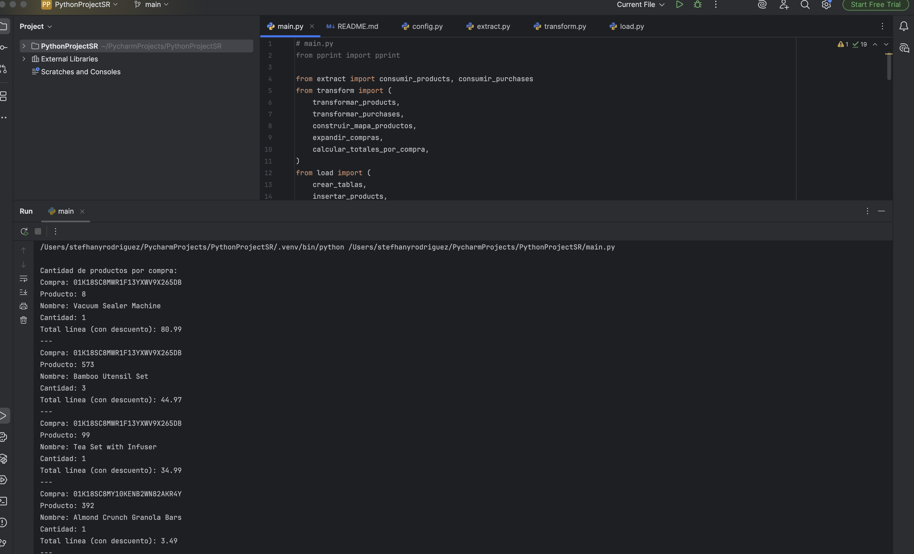
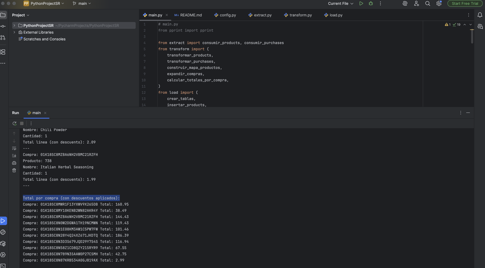
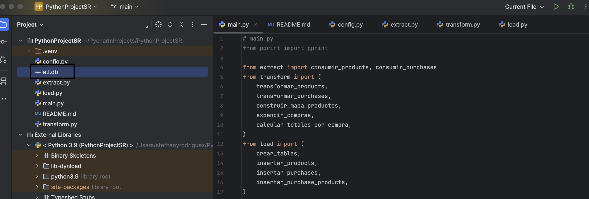

# ETL de E-commerce: Centralización de Datos de Productos y Compras
# Stefhany Rodriguez

## Descripción del proyecto
Este proyecto centraliza la información operativa de una empresa de e-commerce. Los datos provienen de una API externa que tiene información de **productos** y **compras** en formato JSON.  

El flujo ETL (Extraer, Transformar, Cargar) incluye:  
- **Extracción:** Consumo de los endpoints `/products` y `/purchases`.  
- **Transformación:** Limpieza de datos, normalización de productos y expansión de compras por producto, incluyendo el cálculo de descuentos y totales por compra.  
- **Carga:** Inserción de los datos transformados en un Data Warehouse implementado en SQLite con un esquema relacional.

---
## Stack tecnológico
- Lenguaje: Python 3.9
- Base de datos: SQLite
- Librerías: requests, datetime, collections, sqlite3
- Formato de datos: JSON

---

## Instrucciones de ejecución

- Clona el repositorio y entra en la carpeta del proyecto:


- git clone https://github.com/stefhany17/ecommerce_data
- cd 

- Ejecuta el ETL. python main.py

## Arquitectura / Flujo ETL

```bash

  ┌─────────────┐
  │ API Externa │
  │ /products   │
  │ /purchases  │
  └─────┬───────┘
        │
        ▼
┌────────────────┐
│    Extract     │
│  extract.py    │
│ (requests)     │
└─────┬──────────┘
        │
        ▼
┌────────────────────────┐
│      Transform         │
│     transform.py       │
│ - Normaliza productos  │
│ - Expande compras      │
│ - Calcula descuentos   │
└─────┬──────────────────┘
        │
        ▼
┌────────────────────────┐
│         Load           │
│        load.py         │
│ - Inserta products     │
│ - Inserta purchases    │
│ - Inserta purchase_products │
│ (SQLite / Data Warehouse)   │
└─────┬──────────────────┘
        │
        ▼
  ┌─────────────┐
  │  Analítica  │
  │ Consultas / │
  │ Reportes    │
  └─────────────┘


.
├── main.py              # Orquestador ETL
├── config.py            # Configuración de endpoints y DB
├── extract.py           # Extracción de datos desde API
├── transform.py         # Transformación y limpieza de datos
├── load.py              # Inserción de datos en SQLite
└── README.md
```
## Script para crear tablas de destino 

```bash


-- Tabla de productos
CREATE TABLE IF NOT EXISTS products (
    id          INTEGER PRIMARY KEY,
    name        TEXT,
    description TEXT,
    price       REAL,
    category    TEXT,
    created_at  TEXT
);

-- Tabla de compras
CREATE TABLE IF NOT EXISTS purchases (
    id               TEXT PRIMARY KEY,
    status           TEXT,
    credit_card_type TEXT,
    purchase_date    TEXT,
    total            REAL
);

-- Tabla intermedia compras-productos
CREATE TABLE IF NOT EXISTS purchase_products (
    purchase_id TEXT,
    product_id  INTEGER,
    quantity    INTEGER,
    PRIMARY KEY (purchase_id, product_id),
    FOREIGN KEY (purchase_id) REFERENCES purchases(id),
    FOREIGN KEY (product_id)  REFERENCES products(id)
);

```
## Capturas de pantalla del pipeline ejecutándose correctamente.



